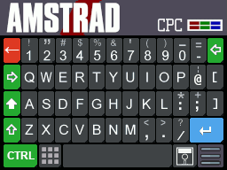

# SugarDS



SugarDS is an Amstrad CPC 646 and 6128 Emulator for the DS/DSi

The Amstrad CPC was released in 1984 and competed with the ZX Spectrum and C64 
in the UK and Eastern EU. Although a latecomer to the market, the solid engineering
"all-in-one" design gathered support. There are still many fans of the system today
and plenty of great homebrew games that fully take advantage of the system strengths.

This emulator is not perfect - but it should be capable enough to render most games
playable on the tiny handheld so you can get your Amstrad gaming on-the-go!

Features :
-----------------------
* Emulates CPC 464 (64K) and CPC 6128 (128K) with 512K of extended RAM available.
* Loads .SNA and .DSK files up to 1024K total length (single and double sided).
* Plus2CPC Cartridge Support to load .CPR files up to 512K (note, this is not a plus/GX4000 emulator but will handle cart files provided they don't require plus-features).
* Partial Dandanator Cartridge Support - Enough for Sword of Ianna and Los Amores de Brunilda. Rename files to .dan to load into the emulator properly.
* Emulates CRTC Type 3 roughly - with provisions to handle split screen, rupture, smooth vertical scroll and a reasonable facsimile of smooth horizontal scroll.
* Full button mapping - supporting all 3 possible joystick buttons of the Amstrad as well as mapping buttons to keyboard keys.
* Full touch-screen Amstrad keyboard styled after the colorful CPC 464.
* Save / Load state so you can pick up where you left off.
* Full support for the Spanish CPC 472 machine with the extra 8K of memory! :)

Copyright :
-----------------------
SugarDS is Copyright (c) 2025 Dave Bernazzani (wavemotion-dave)

Bits of pieces of this emulator have been glued and attached from 
a large number of sources - along with a healthy amount of code by 
this author to pull it all together. Although it was hard to trace 
everything to the original sources, I believe all sources have 
released their material under the GNU General Public License and, 
as such, the SugarDS emulator follows suit.

If I've misrepresented any previous authors work here, please
contact me and I'll put it right.

* CrocoDS: CPC Emulator for the DS - Copyright (c) 2013 Miguel Vanhove (Kyuran)
* Win-CPC: Amstrad CPC Emulator - Copyright (c) 2012 Ludovic Deplanque.
* Caprice32: Amstrad CPC Emulator - Copyright (c) 1997-2004 Ulrich Doewich.
* Arnold: Amstrad CPC Emulator - Copyright (c) 1995-2002, 2007 Andreas Micklei and Kevin Thacker

As far as I'm concerned, you can use this code in whatever way suits you provided you 
continue to release the sources under the original copyright notice (see below) which
appeared to be the intention of all the pioneers who came before me.

The sound driver (ay38910) are libraries from FluBBa (Fredrik Ahlström) 
and those copyrights remain his.

Royalty Free Music for the opening jingle provided by Anvish Parker

lzav compression (for save states) is Copyright (c) 2023-2025 Aleksey 
Vaneev and used by permission of the generous MIT license.

The Amstrad CPC logo is used without permission but with the maximum
of respect and love. Thank you Alan.

The SugarDS emulator is offered as-is, without any warranty.


BIOS Files :
-----------------------
Following in the footsteps of virtually all other Amstrad CPC emulators, the BIOS
files are included in the emulator and don't need to be sourced by the user. This
is according to a note from Cliff Lawson:

"If you are the author of such an emulator then you don't need to write and ask me for 
Amstrad's permission to distribute copies of the CPC ROMs. Amstrad's stance on this is
that we are happy for you to redistribute copies of our copyrighted code as long as 
a) copyright messages are not changed and 
b) either in the program or the documentation you acknowledge that "Amstrad has kindly 
given it's permission for it's copyrighted material to be redistributed but Amstrad 
retains it's copyright."

So the Amstrad CPC BIOS files are still copyrighted by Amstrad - in whatever form
that may exist. If you are in an official capacity as the copyright owner of the 
BIOS files and wish these stripped from the emulator, please contact me and I'm 
happy to do so!  Otherwise - many thanks for the indirect permission to use them.


## Original Copyright Notice for the Software (not BIOS files)
```
This program is free software; you can redistribute it and/or modify
it under the terms of the GNU General Public License as published by
the Free Software Foundation; either version 2 of the License, or
(at your option) any later version.

This program is distributed in the hope that it will be useful,
but WITHOUT ANY WARRANTY; without even the implied warranty of
MERCHANTABILITY or FITNESS FOR A PARTICULAR PURPOSE.  See the
GNU General Public License for more details.

You should have received a copy of the GNU General Public License
along with this program; if not, write to the Free Software
Foundation, Inc., 59 Temple Place, Suite 330, Boston, MA  02111-1307  USA
```

Main Menu :
-----------------------
After the emulator launches (unless you've directly launched a game via Twilight Menu++), you will be 
presented with the main menu screen. From here you can load up a disk or cart file to play.


Filenames can be no longer than 160 characters (and the DS can only display 32 at a time and will scroll
the title of a game as needed) - so please keep your filenames on the shorter side. You can have no more 
than 1024 game files in a directory - but can have as many directories as you want.

Loading Games :
-----------------------
When loading games, you can use the SELECT button on your DS to toggle a game between 'like' (yellow heart) 
and 'love' (red heart). These will auto-persist so you can always come back and find your favorite games.


Configuration :
-----------------------
There is quite a few configuration options that you can explore. Some options are global for the emulator
and some are specific to one game. Please note that the options are associated with the filename (e.g. your
.dsk file on the SD card) of the game you are playing. If you change the filename, the options will have
to be re-entered.


When you change options, you must hit the START button on the DS to save out the new configuration to your SD card. 
Otherwise the options will only work for this game play session.

If you are playing a game like Robocop, Chase HQ or Manic Miner which hits the AY sound chip hard to produce "speech" or 
similar digitizied effects, you should set the **Sound Driver** to 'WAVE DIRECT'. This is a bit more taxing on the emulator
but it will render speech and other digitized effects quite well.

Of primary importance to gameplay are these two: **R52 vSync** and **CPU Adjust**.

Normally you shouldn't touch either adjustment... unless the game is not running correctly. In that case, try the following:

* If the game is running slower than on real hardware (e.g. Dizzy III which slows down when you move) then adjust the R52 vSync to 'Forgiving'.
* If the game has minor graphical glitches - say a stray line (e.g. Sword of Ianna on screen transitions) then try a CPU Adjust of -1 or -2 at most.

Because the emulator is doing line-based (vs cycle-based) emulation, the accuracy is only to that of a scanline and sometimes these small tweaks are 
necessary to get games running as close as possible to real hardware.

A number of commercial games will be auto-recognized and will have some tweaks automatically selected so they run as close to perfect as I can get them.

One option that can be handy for certian ladder or maze games is the D-Pad "Slide-n-Glide" which was designed originally for my ZX Spectrum emulator and
specifically for Chuckie Egg. Sometimes with climbing/maze games it's hard to make the exact turn onto a ladder. With 'Slide-n-Glide', the controls will be
more forgiving by continuing to move in the Left/Right or Up/Down direction for a few more frames while another direction is pressed. This makes it much (much!)
easier to navigate onto and off of ladders in games like Chuckie Egg... Maze Games (pacman, etc) also benefit.

Key Mapping :
-----------------------
Any of the non shoulder buttons can be mapped to any joystick button and/or keyboard key.


The shoulder buttons are special:

Shoulder button L + D-Pad for offset
Shoulder button R + D-Pad for scale (turn off auto-scale)

Pan/Scan and Offset Handling :
-----------------------
Sadly, the DS screen at 256x192 pixels is no match for the Amstrad CPC which utilizes one of three modes:

* Mode 0: 160x200 in 16 colors
* Mode 1: 320x200 in 4 colors
* Mode 1: 640x200 in 2 colors

Further, the 200 vertical pixels is often extended via programming techniques that allow for even more vertical 
resolution - I've seen some games like Bomb Jack Extra Sugar and the official Ocean Donkey Kong that utilize as
much as 256 pixels of vertical resolution - and we simply can't display that many pixel rows on our poor DS.

And, if that wasn't complicated enough... the Amstrad CRTC chip can be programmed to vary the horizontal rendering
as well... so the poor DS really has a lot to cope with!

To that end, you will have to get creative and understand the tools available in the emulator to help you get the
game running as best we can. This includes Pan Up/Down, Offset and Pan-and-Scan features I've added to this emulator.

Of primary importance is the L/R buttons to shift/scale the screen as the Amstrad
CPC will often utilize more pixels than the DS has resolution (192 vertical pixels)
so you will be forced to either compress (squash) the screen or else position the 
screen carefully and map one of the buttons to PAN UP or PAN DOWN the screen briefly.

This works really well for games that show status or score at the top or bottom of 
the screen but otherwise doesn't really affect the main gameplay area. I tend to use the X button
to PAN UP or PAN DOWN depending on where the score/status portion of the screen is displayed
for a given game.  Some games you may want to map one button to PAN UP and another to PAN DOWN 
and keep the central part of the game visible on the main display. Experiment and you should be able
to find combinations that allow a great many Amstrad CPC games to play well enough to enjoy!


Another tool in the toolbox is Pan-and-Scan mode. When this is enabled in the main options for a
given game, two little left/right arrow icons appear on the title bar in the touch-screen area.


This scales the screen 1:1 but that means some graphics will be off the left/right sides of the 
DS display. touching the title bar anywhere near the arrows (the hit-box here is much larger than
the arrow indicators) you can shift the screen left/right. This makes playing some adventure games
easier as you can more cleanly read the text rendering and the panning left/right can be done at 
lesiure. This will allow games like Orion Prime to be playable so you can actually read the emails 
you're getting in-game.


DISK Support :
-----------------------
.DSK files up to the maximum allowed by 3.5" drives using PARADOS is roughly 720K. Most
disks should auto-load but if your disk does not, it should provide a catalog of the
possible filenames that could be used to run the program. One trick is to include
the command you want to run in the filename of the .DSK file itself. That helps the
auto-type detection algorithm. To force a very specific run command, place the name
of the Amstrad CPC file you wish to run in double brackets like this:

"Orion Prime 3_5 Inch Disk [[ORION]].dsk"

This when that .dsk file is loaded, the emulator will sense what's between the double
brackets and issue the proper RUN "ORION" command

Note that sometimes one disk version of a game won't load properly but a different version will.
Keep looking - you're very likely to find a version that will load and play correctly. Such is
life with emulation and potentially dodgy disk dumps.

Cartridge Support :
-----------------------
Although .CPR cartridges up to 512K are supported, this is not a CPC+ (plus) emulator.
So games like ALCON 2020 work fine... as do any other .CPR games that do not specifically
utilize the GX4000 or Amstrad CPC+ (plus) graphics capabilities. 

Dandanator Support :
-----------------------
Mainly to run two games - Sword of Ianna and Los Amores de Brunilda. Rename those .rom
files as .dan files so that they will be loaded as Dandanator files within the SugarDS
emulator. Note that we do not support Flash writes on these carts - but the games
themselves should be playable and you can use the normal emulator save/load states
to save your progress.

SNA Support :
-----------------------
Memory snapshots are supported for both 64K and 128K machines as well as expanded 576K machines.
You should strongly prefer to use .DSK or .CPR (or .DAN) files as snapshots cannot save data nor can they multi-load
and the .dsk emulation is fast enough that the difference between a disk load and a snapshot load is just a few
extra seconds. Think about how long it took to load stuff from cassette/disk when we were kids ... we're so spoiled now!

Known Issues :
-----------------------
* Pinball Dreams has graphical glitches on the opening lead-in screens... gameplay is better.
* R-Type Reloaded 128K does not load correctly except for the 3-disk version which does work (despite some loading screen issues - when the screen shows horizontal lines, insert disk 2).
* Megablasters has issues with the emulated CRTC type detection and won't start except for one version which I've added a patch for: The 2020 ENGLISH Re-Release version (4 disks).
* Enlightenment (aka Druid 2) has major graphical glitching. Cause is likely inaccurate CRTC emulation.
* Imperial Mahjongg does not run. Cause is likely inaccurate CRTC emulation.
* Sugar City has graphical glitches top/sides. You can position and stretch the screen to largely push these off the LCD so they aren't as distracting. Cause is likely inaccurate CRTC emulation.
* Out of This World has graphical glitches and frame sync issues. Likely inaccurate CRTC emulation.
* Turrican 128K works fine with the two disk version but the single disk 'PARADOS' version won't load.

Version History :
-----------------------
Version 1.4 - 19-Nov-2025 by wavemotion-dave
* DSi now double-buffers LCD rendering for smoother performance and syncs to true 50Hz refresh.
* Added Favorites system - use SELECT when loading games to toggle between like/love.
* Added new 130% rendering speed as a per-game option.
* Improved key map handling - all virtual Amstrad CPC keys are now mappable to the NDS keys.
* Added vertical jitter handling - improves look of vertical compression making games like Tempest look much improved when scaled.
* Improved save state support - AY music is properly restored when loading an old save state.
* Added instructions for use on first boot of the emulator.
* Switched to O3 optimization for a few more frames of performance.
* Lots of other small improvements and cleanups under the hood as time permitted.

Version 1.3 - 13-Sep-2025 by wavemotion-dave
* Use [[CPM]] in title of .dsk file to launch game via |cpm
* Improved FDC emulation so games like BAT load
* Improved PPI emulation so keyboard scanning works in games like Barbarian
* Fixed the map keys handling so changing the first key slot doesn't always revert back to 'A'
* Other minor improvements and tweaks under the hood.

Version 1.2 - 22-Jun-2025 by wavemotion-dave
* Less pops clicks when going in/out of selecting games.
* Cleaner/Faster Disk Writes (less pause, better "DISK WRITE" notification)
* Improved Z80 timing - found a few more instructions that needed timing tweaks.
* Improved CRTC emulation - fixed regression on Pinball Dreams, etc. Back to emulation of Type 3.
* Fix for two-sided drive signal for FDC (nothing seemed to be affected by this... but better to be accurate).
* Improved pan/scan for Mode 2 - auto-center and smoother scroll.
* Improved offset handling - cleaner 1 pixel move and faster press-and-hold.
* Added ESC as a possible key map.

Version 1.1 - 18-Jun-2025 by wavemotion-dave
* New 'Advanced' CRTC driver that renders Prehistorik II and Super Cauldron (among others) playable. Should auto-detect.
* Megablasters 2020 Re-release (ENGLISH) is now supported - start by loading Disk A (Disk 0).
* SNA snapshots can now be up to 576K of RAM memory.
* Improved Mode 2 driver to better render graphics on the small screen.
* Improved Mode 0/1 driver so we don't swap too quickly between modes (less screen flash/shifts).
* Improved all CRT rendering so we have less graphical issues especially when moving from screen to screen. Games like Monty on the Run are good examples of how clean this is now.
* Lots of other little cleanups and improvements as time permitted.

Version 1.0 - 13-Jun-2025 by wavemotion-dave
* Improved Z80 / CRTC timing so more games run more correctly.
* Improved Mode 2 rendering so it's a little better positioned 'compressed' on the DS screen.
* Improved default key mapping that maps Y button to Joystick Fire 2 (used by many homebrews).
* Another round of improvements for FDC handling of two-sided disks. Orion Prime no longer warns of disk issues, Batman Forever 3.5" loads.
* Fixed the sound mute handler so that there are less frequent pops/clicks when loading up new games.
* Improved auto-load detection - more disks load the correct file more often.
* Lots of small cleanups and commenting of the code.

Version 0.9 - 08-Jun-2025 by wavemotion-dave
* Fix disk write-back so it doesn't potentially corrupt a .dsk file! Sorry about that.
* Improved save/load state so it preserves Dandanator carts and Extended Memory > 128K.
* More robust CRTC handling to fix games like Hypernoid Zero, Galactic Tomb 128K and Bomb Jack Extra Sugar.
* You can now put [[cmd]] in the title of the .dsk file to force a RUN command.
* Other cleanups, minor timing improvements and fixes as time allowed.

Version 0.8 - 06-Jun-2025 by wavemotion-dave
* Tweaks to the Z80 core timing to get it closer to real Amstrad performance. Fewer graphical glitches in games.
* Improved two-sided disk support.
* Memory expansion up to 512K is now supported - Mighty Steel Fighters now runs.
* Dandanator support for cart-banking (only - no EEPROM writes).
* Screen dimming of bottom screen added.
* Other minor cleanups and fixes as time allowed.

Version 0.7 - 04-Jun-2025 by wavemotion-dave
* Double sided disks now supported. Orion Prime in 3.5" floppy works!
* Disks now auto-persist back to the SD card when written.
* CPU Z80 timing improved - more games run more correctly.
* Better auto-filename support for launching disk games.
* Number pad added - press the number pad icon on the main keyboard.
* Mode 2 support improved - use PAN or COMPRESSED mode and upper screen region (the Amstrad Logo area) to pan.
* New Amstrad Croc top screen available - use Global Settings.
* Improved auto-scale in the X (horizontal) direction.
* Minor tweaks and bug fixes as time allowed.

Version 0.6 - 02-Jun-2025 by wavemotion-dave
* Cartridge .CPR support up to 512K
* Disk support is now up to 3.5" 80-track maximums (720K)
* Multi-disk support added - you can swap disks mid-game via the menu
* Cleanup of Z80 timings so more games run more correctly with fewer graphical glitching

Version 0.5 - 01-Jun-2025 by wavemotion-dave
* First public beta. Enjoy!
