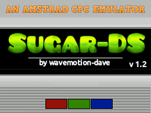

# SugarDS

SugarDS is an Amstrad CPC 646 and 6128 Emulator for the DS/DSi

Features :
-----------------------
* Loads .SNA and .DSK files up to 200K in length
* Emulates CPC 464 (64K) and CPC 6128 (128K)

Copyright :
-----------------------
SugarDS is Copyright (c) 2025 Dave Bernazzani (wavemotion-dave)

Coming soon!
